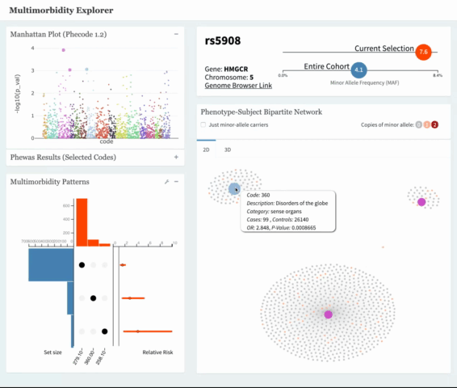
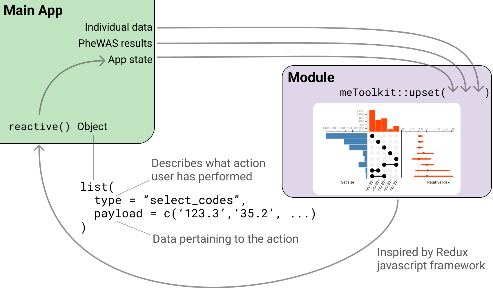
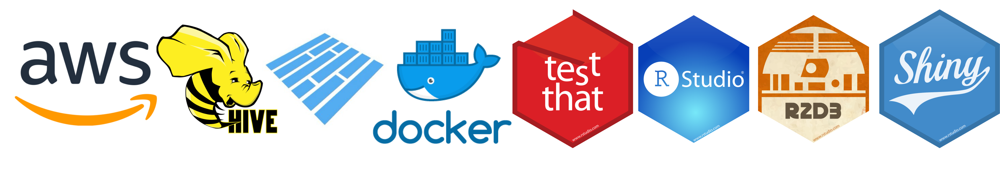
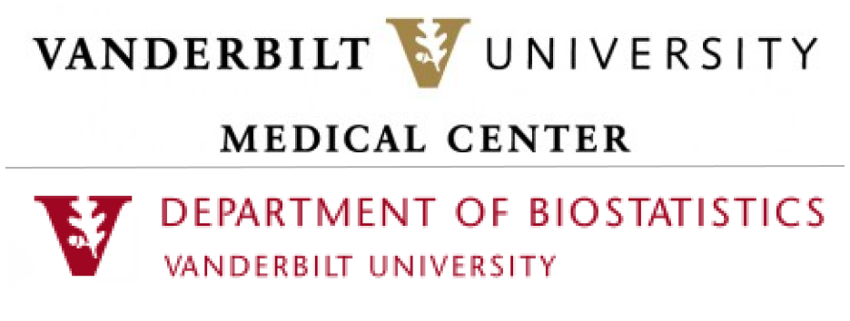
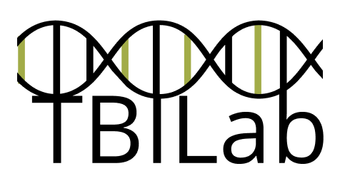

<style>
body {
  font-family: 'optima';
  font-size: 1.3em;
  background: black;
}

#row-2 .chart-title {
  display: none;
}


#row-2 .chart-wrapper {
  margin-right: 0;
  border: none;
  border-radius:0;
}

#row-2 {
  font-size: 0.9em;
}

</style>

About {data-orientation=rows}
=====================================  
   
Row {data-height=800}
-------------------------------------


### Background
   
As electronic health records (**EHR**) and **biobanks** have grown in popularity, so has the amount of data available to **discover relationships between a patient's genotype and phenotype**.

#### `r icon::fa('users',fixed_width = TRUE)` Individual-Level data

EHRs contain vast quantities of information for individual patients. One useful set of information is ICD9 and ICD10 codes. These are used to keep track of billable actions. The **PheCode** is a mapping of ICD codes to **phenotype** (or patient conditions) for research purposes. E.g. Phecode 360.2: Progressive Myopia. Additionally, biobanks provide data on a patient's biomarkers such as genetic mutations (aka their **genotype**.)

#### `r icon::fa('dna',fixed_width = TRUE)` PheWAS

Developed at Vanderbilt, a popular method for linking genotypes with phenotypes is the Phenome-Wide Association Study (PheWAS). PheWAS uses EHR data to produce a list of phenotypes significantly associated with a pre-specified genotype.


### App usage {.no-padding}


<!-- <video autosize: true controls> -->
<!--   <source src="me_usage.mov" type="video/mp4"> -->
<!-- </video> -->



### What does the app do?

ME is a shiny application that allows researchers to explore the results of PheWAS studies along with investigating individual-level data that produced those results.
    

#### `r icon::fa('hand-point-up',fixed_width = TRUE)` Interact with results 

PheWAS results are typically delivered with static plots and tables. ME allows researchers to interact with those results.

#### `r icon::fa('expand-arrows-alt',fixed_width = TRUE)` Expand past plain associations

By giving researcher's the ability to look at the network behavior of genotype-phenotype associations, ME allows for more nuanced insights from data than a single P-Value can provide. 
     
#### `r icon::fa('boxes',fixed_width = TRUE)` Current deployments

ME is currently being used in the following scenarios: 

- Exploring more nuanced Heart Failure phenotypes.
- Drug repurposing
- Rare-disease detection


 
### Interactivity driven by R2D3
    
All plots are custom-built interactive javascript visualizations made with the help of the package r2d3. Visualizations use both d3.js and three.js for efficient rendering of large amounts of data.

```{r, cached = TRUE}
network_data <- readr::read_rds('data/sample_network_data.rds')
r2d3::r2d3(
  jsonlite::toJSON(network_data),
  script = 'js/network_2d.js',
  container = 'div',
  dependencies = "d3-jetpack",
  options = list(
    just_snp = FALSE,
    msg_loc ='message'
  )
)

```
  
  
    


  

Row {data-height=800}
-------------------------------------
      

  
### Shiny modules  

To ease the creation of new versions for different use-cases, a helper package **meToolkit()** with shiny modules was built. Standardized input and output allow easy swapping and testing of app components. 




### Technologies & packages used

#### `r icon::fa('keyboard',fixed_width = TRUE)` Development 

All coding done in **RStudio Server Pro** hosted on **AWS EC2**. The app is a **Shiny** app in dashboard format thanks to **Shinydashboard**. Custom interactive plots are built with **d3.js** and called from R using **R2D3**. 

#### `r icon::fa('database',fixed_width = TRUE)` Data Management

Data for the app is managed using **Hive** running on **AWS Athena**. The larger-than-memory datasets are stored in **Apache Parquet** files for efficient queries. 


#### `r icon::fa('truck',fixed_width = TRUE)` Deployment

Completed apps are most frequently hosted on lab's **RStudio Connect** server. Occasionally, apps are run locally using **Docker** containers for speed and security reasons.





### Information
    
#### Me (Nick Strayer):
- 4th year PhD candidate in Biostatistics at Vanderbilt University
- Previously at New York Times and Johns Hopkins Data Science Lab
- [nickstrayer.me](nickstrayer.me), `r icon::fa('twitter')` @nicholasstrayer,  `r icon::fa('github-alt')` nstrayer, [livefreeordichotomize.com](livefreeordichotomize.com)

#### TBILab (Translational Bioinformatics Lab) 
- Focused on using modern data mining and machine learning techniques to help reveal valuable clinical information in messy EHR and biobank data. 
- PI: Yaomin Xu, Professor Biostatistics and Bioinformatics.

#### Software

- **[`r icon::fa('github-alt')` tbilab/multimorbidity_explorer](https://github.com/tbilab/multimorbidity_explorer)**
    - Full application with data-input landing page for running with your own data. 

- **[`r icon::fa('github-alt')` tbilab/meToolkit](https://github.com/tbilab/meToolkit)**
    - Package with individual components of main-app available as shiny modules.
    - R Package built with **devtools** and **usethis**

- **[`r icon::fa('github-alt')` tbilab/me_docker](https://github.com/tbilab/me_docker)**
    - Docker image for deploying ME applications.

    

Row {data-height=130}
-------------------------------------

### left

This research and application are made possible due to the following support: 


CTSA award No. UL1 TR002243 from the National Center for Advancing Translational Sciences.


### mid

Many thanks to those that helped support this research: 

Quinn Wells, Pharm.D., M.D. |  Michael R. Savona, M.D.  
Joshua C. Denny, MD, MS |  Vanderbilt Drug Repurposing program


### right {.no-padding}




### farright {.no-padding}



Demo {data-orientation=rows}
=====================================     


<iframe src="http://localhost:3838/multimorbidity_explorer/" width=100%, height=100%></iframe>
