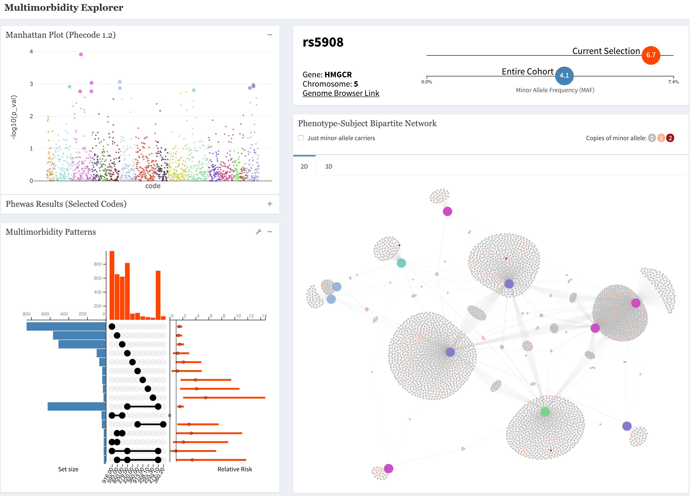

Introduction {data-orientation=rows}
=====================================  
   
Row {data-height=800}
-------------------------------------


### Background
   
As electronic health records (**EHR**) and **biobanks** have grown in popularity, so has the amount of data available to **discover relationships between a patient's genotype and phenotype**.

#### Individual-Level Data

EHRs contain vast quantities of information for individual patients. One useful set of information is ICD9 and ICD10 codes. These are used to keep track of billable actions. The **PheCode** is a mapping of ICD codes to **phenotype** (or patient conditions) for research purposes. E.g. Phecode 360.2: Progressive Myopia. Additionally, biobanks provide data on a patient's biomarkers such as genetic mutations or their **genotype**.

#### PheWAS

Developed at Vanderbilt, a popular method for linking genotype's with phenotypes is the Phenome-Wide Association Study (PheWAS). PheWAS uses EHR data to produce a list of phenotypes significantly associated with a pre-specified genotype.


### What Problem is Solved?
    
#### Interact with results 
PheWAS results are typically delivered with static plots and tables. ME allows researchers to instantly explore the results, digging into to the tables and looking for driving patterns.

#### Expanding past plain associations

PheWAS results look at a genotype's association with a given phenotype one phenotype at a time. By giving researcher's the ability to look at the network behavior of genotype-phenotype associations, ME allows for more nuanced insights from data than a single P-Value can provide. 
     


### App Screenshot {.no-padding}



 

### Technologies & Packages Used

#### `r icon::fa('keyboard')` Development 

All coding done in **RStudio Server Pro** hosted on **AWS Ec2**. The app is a **Shiny** app in dashboard format thanks to **Shinydashboard**. Custom interactive plots are all build with **d3.js** and called from R using **R2D3**. 

#### `r icon::fa('database')` Data Management

Data for the app managed using **Hive** running on **AWS Athena**. The larger-than-memory datasets stored in **Apache Parquet** files for efficient queries. 


#### `r icon::fa('truck')` Deployment

Completed apps are most frequently hosted on **RStudio Connect** server. Occasionally apps are run locally using **Docker** containers for speed and security reasons.


  

  

Row {data-height=800}
-------------------------------------
      

  
### Shiny Modules  


### Interactivity Driven by R2D3
    

```{r, cached = TRUE}
network_data <- readr::read_rds('data/sample_network_data.rds')
r2d3::r2d3(
  jsonlite::toJSON(network_data),
  script = 'js/network_2d.js',
  container = 'div',
  dependencies = "d3-jetpack",
  options = list(
    just_snp = FALSE,
    msg_loc ='message'
  )
)

```
  
  
    


### Availability
    
#### Main App 

Full application with data-input landing page for running with your own data. 

- MIT licenced
- [`r icon::fa('github-alt')` tbilab/multimorbidity_explorer](https://github.com/tbilab/multimorbidity_explorer)

#### meToolkit package

Lab package with individual componenets of main-app available as shiny modules. 

- MIT licenced
- R Package built with **devtools** and **usethis**
- Tested with **testthat**
- Documented with **roxygen**
- [`r icon::fa('github-alt')` tbilab/meToolkit](https://github.com/tbilab/meToolkit)
    
    
    

Row {data-height=100}
-------------------------------------

### Acknowledgements

Acknowledgements go here.

Demo {data-orientation=rows}
=====================================     
   
Row {data-height=600}
-------------------------------------


### Chart 1

```{r}
```

Row {data-height=400}
-------------------------------------
   
### Chart 2

```{r}
```   
    
### Chart 3

```{r}
```


Lessons Learned {data-orientation=rows}
=====================================     
   
Row {data-height=600}
-------------------------------------

### Chart 1

```{r}
```

Row {data-height=400}
-------------------------------------
   
### Chart 2

```{r}
```   
    
### Chart 3

```{r}
```
